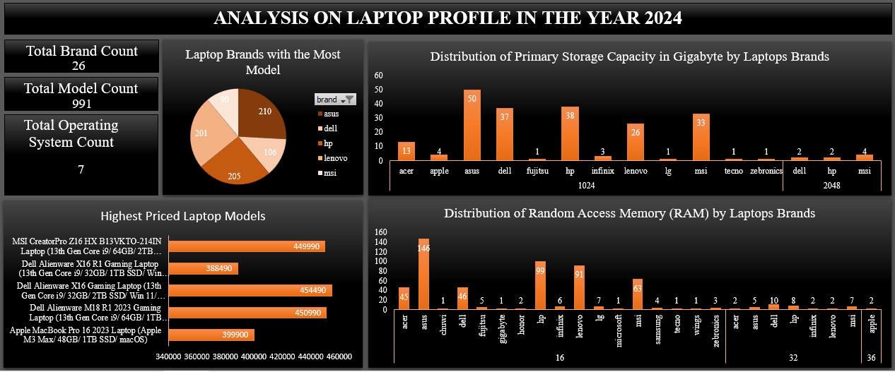

# PROJECT 
## ANALYSIS ON LAPTOP PROFILE IN YEAR 2024

### DASHBOARD

### DATA UNDERSTANDING
- Dataset on the profile of various laptop brands in the year 2024.
- Dataset has 991 rows and 13 columns.

### INTRODUCTION
Laptops are important tools for work, study, and entertainment, but with so many brands and models available, choosing the right one can be difficult. Two key factors that affect a laptop's performance are the amount of RAM (memory) and storage capacity.
This project focuses on analyzing different laptop models from various brands, specifically looking at their RAM and storage capacity. The goal is to find out which brands offer the best options for high-performance laptops and to see how these brands compare in terms of the number of models they provide.

### PROBLEM STATEMENT
The current market offers a wide range of laptop models across various brands, each with differing specifications in terms of RAM and storage capacity. However, consumers face challenges in identifying which brands provide the best options for high-performance laptops, particularly those with higher RAM and storage capacity.

### OBJECTIVE
To analyze the distribution and availability of laptop models across different brands, with a focus on variations in RAM and storage capacity, and to identify which brands dominate the market in terms of high-performance specifications.

### ANALYTICS TECHNIQUE
Prescriptive.

### BENEFIT OF ANALYSIS
This analysis seeks to uncover trends in the availability of these specifications across different brands, identify gaps in the market, and determine which brands dominate in offering models.

### EMERGING QUESTIONS
1. How many laptops and models are taken into consideration for the analysis?
2. How many operating systems are considered for this analysis?
3. What is the random-access capacity of each model?
4. What is the distribution of primary storage capacity for each brand
5. Which are the highest priced model brands?
6. Which brands have the most number of models?

### DATA DICTIONARY
- Index: Unique identifier of each model.
- Brand: A name or trademark of the company that designs, manufactures, and sells laptops.
- Model: Specific versions of laptops produced by a brand.
- Price: How much the laptop model is sold for in Indian rupees.
- Ratings: The range/scale used to evaluate the performance.
- Processor Brand: The company that designs and manufactures the Central Processing Unit (CPU).
- Ram Memory: It means random access memory is a type of computer memory that can be accessed randomly, making it fast able to access data quickly.
- Primary Storage Type: It is the main storage device used to store the operating system, applications and data files.
- Primary Storage Capacity: It refers to the amount of data that a laptop’s main storage device can hold. It is measured in gigabytes (GB) or terabytes (TB).
- Is Touch Screen: It is whether or not it is screen touch sensitive.
- Display Size: It is the diagonal measurement of a screen mainly in inches.
- OS: Operating System is the company that manages computer hardware and provides services for computer programs.
- Year of Warranty: It is the period which manufacturers promise to replace the product if it defects.

### DATA PRESENTATION
- Data Cleaning: Microsoft Excel
- Data Visualization: Pivot Chart on Microsoft Excel

### FINDINGS
1. For this analysis, 26 laptop brands and 991 models were considered.
2. After filtering the models by RAM (16, 32, and 36), I found that only Apple produces 2 models with 36 GB of RAM, while many brands have models with 16 GB of RAM.
3. When filtering by primary storage capacity (1024, and 2048 GB), I discovered that only three brands offer models with 2048 GB, while a significant number of brands produce models with 1024 GB.
4. The brands with the highest number of models are Dell, MSI, and Apple.
5. Asus produces the most models, with 210, while Ijo, Walker, and iBall each produce only one model.

### RECOMMENDATION
I would recommend based on the analysis that the following brands; Apple, Deli, Lenovo, MSI and Asus have models which fulfills all the criteria for an effective and smooth-running laptop. Although other laptop brands possess some characteristics with those written above, I was able to come to my conclusion due to popular ratings.

### CONCLUSION
There exist so many laptop brand’s model in the world. Some are good when used for basic applications however, if complex applications are installed in them, the laptops tend to crash or as frequently said “hang”. It is mandatory for one to consider what a laptop would be used for before purchasing it. Therefore, when purchasing a system look out for the processor tier, random access memory, amongst other things.
